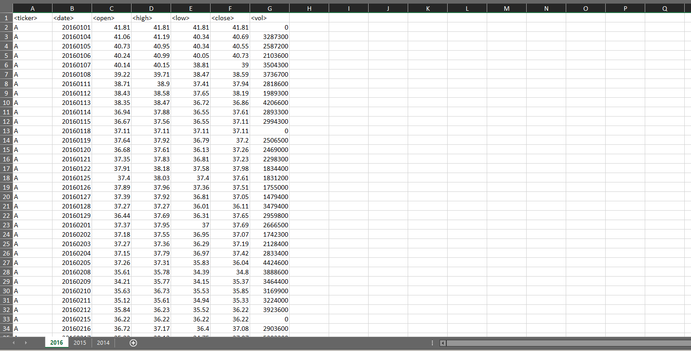
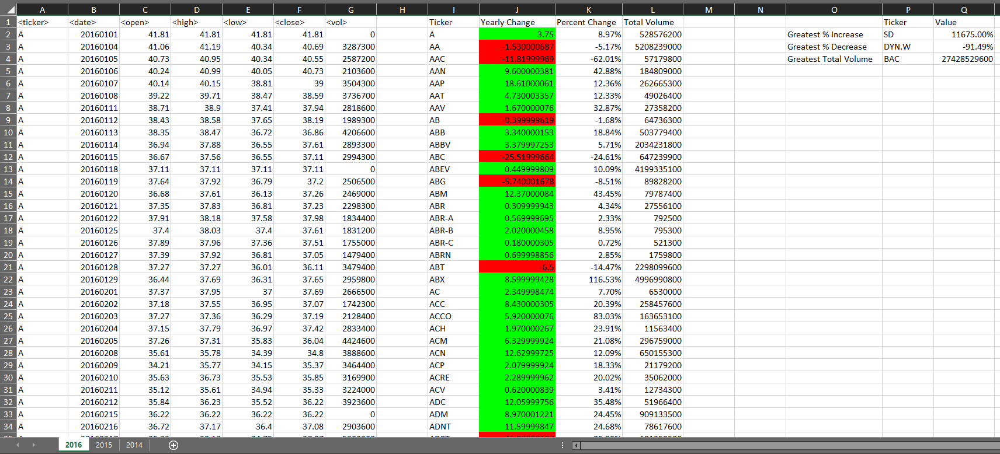
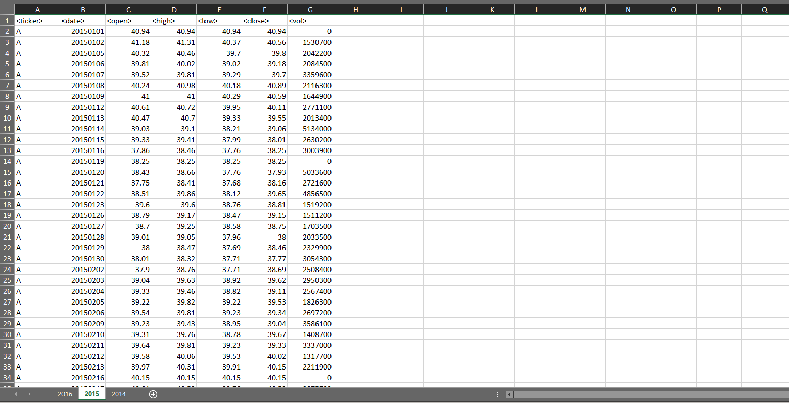
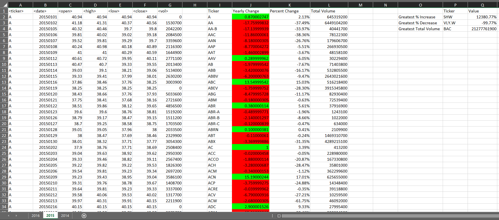
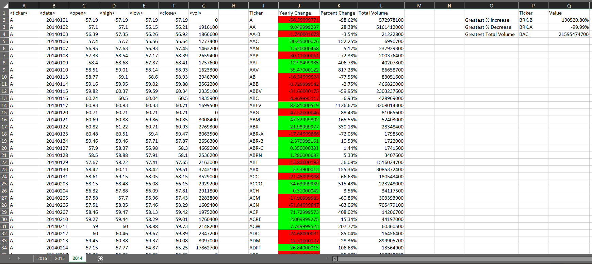

# Yearly Stocks

A VBA macro that analyzes an Excel Workbook (./resources/Multiple_year_stock_data.xlsx) of real stock market data then updates said Workbook with outcomes of the analysis.  

*This was a homework assignment for Washington Univeristy's Data Analytics Boot Camp 2019*

The script: "./AnalyzeStockData.cls" performs an analysis on three years of stock data, each distinguished by their own Excel Worksheet (2016, 2015, 2014). Each Worksheet has seven initial columns of stock data \<ticker>, \<date>, \<open>, \<high>, \<low>, \<close>, and \<vol> with a total of 2,263,614 rows between the three. The script will loop through each year of stock data and grab the yearly change between opening and closing price ("Yearly Change"), the percent change between opening and closing price ("Percent Change"), and the total volume of the stock ("Total Stock Volume"). Additionally, the script also identifies stock with the greatest percentage increase ("Greatest % increase"), the greatest percentage decrease ("Greatest % Decrease"), and the greatest total volume ("Greatest total volume"). Below are images of the Excel Workbook containing the stock data before and after the script is executed.

*Note: Developer tools and macros must be enabled in the Workbook before running script.*

## Before (2016)

## After (2016)

## Before (2015)

## After (2015)

## Before (2014)

## After (2014)
